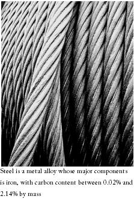
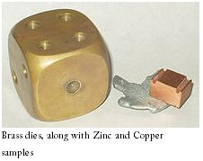

## Theory

  

 

Alloying a metal is done by combining it with one or more other metals or non-metals that often enhance its properties. The term alloy is used to describe a mixture of atoms.  A metallic solid solution composed of two or more elements is called an Alloy. This is a homogeneous mixture and its constituents are usually measured by mass. Usually, from those of the component elements it has different properties and its components, the primary constituent is a metal, which is called the base or the matrix. An alloy with mixture of only two types of atoms, not counting impurities, then it is called a binary alloy (e.g. Copper-nickel alloy), if there are three types of atoms in a mixture then it is called a ternary alloy, (e.g. iron, nickel and chromium) if four constituents in a mixture, which is a quaternary alloy, while a five-part alloy is termed a quinary alloy.

<h2>Different Types of Alloys</h2>

<h3>Alloys of Aluminium</h3>
<ul>
  <li>AA-8000: used for building wire in the U.S. per the National Electrical Code</li>
  <li>Aluminium also forms complex metallic alloys, like β-Al-Mg, ξ'-Al-Pd-Mn, T-Al3Mn</li>
  <li>Al-Li (lithium)</li>
  <li>Alnico (aluminium, nickel, cobalt): used for permanent magnets</li>
  <li>Duralumin (copper)</li>
  <li>Kryron</li>
  <li>Magnalium (5% magnesium): used in airplane bodies, ladders, etc.</li>
  <li>Nambe (aluminium plus seven other undisclosed metals)</li>
</ul>

<h3>Alloys of Bismuth</h3>
<ul>
  <li>Cerrosafe (lead, tin, cadmium)</li>
  <li>Rose metal (lead, tin)</li>
  <li>Wood's metal (lead, tin, cadmium)</li>
</ul>

<h3>Alloys of Cobalt</h3>
<ul>
  <li>Megallium</li>
  <li>Stellite (chromium, tungsten, carbon)</li>
  <li>Talonite</li>
  <li>Ultimet (chromium, nickel, molybdenum, iron, tungsten)</li>
  <li>Vitallium</li>
</ul>

### Brass:
 

It is an alloy, contains copper and zinc as major constituents. Depending upon the proportions of copper and zinc the properties and range of the brass changes.

Bronze is an alloy of copper and tin. Bronze contains not only tin, and it contains a variety of alloys of arsenic, phosphorus, aluminium, manganese, and silicon with copper are commonly termed bronze.

  

 

<h2>Applications of Brass</h2>

Brass is a substitutional alloy.

<ul>
  <li>Because of its gold-like appearance, it is used in decoration and for making coins.</li>
  <li>Brass is used for making locks, bearings, doorknobs, and valves.</li>
  <li>Due to its acoustic properties, it is used in musical instruments such as horns and bells.</li>
  <li>Due to its softness compared to other metals, it is also used in zippers.</li>
  <li>It is also used for fittings and tools around explosive gases.</li>
  <li>It is easy to shape and resistant to tarnishing.</li>
  <li>Polished brass was used as a mirror in antiquity.</li>
</ul>

The colours of brass range from red to yellow to gold to silver. By the addition of 1% manganese, a chocolate brown colour is obtained, and a brilliant silver colour can be achieved by polishing with nickel silvers.

The major constituent of brass is Cu (50–90%) and Zn (20–40%). Small amounts of Sn (0–6%), Pb (0–2%), Fe (0–1%), and sometimes traces of Al, Ni, and Mn may also be present. The analysis involves the separation and estimation of Cu, Zn, Sn, Pb, and Fe present in brass.

<strong>Copper</strong> can be estimated quantitatively as CuSCN in a feebly acidic solution by adding ammonium thiocyanate in the presence of H3PO4.

<strong>Zinc</strong> is estimated after removing copper as CuSCN. In alkaline medium, Zn2+ ions react with ammonium hydrogen phosphate and can be gravimetrically separated.

The other constituents like <strong>Sn</strong> (tin), <strong>Fe</strong> (iron), and <strong>Pb</strong> (lead) are separated gravimetrically by precipitating Sn as SnO2, Fe as Fe(OH)3, and Pb as PbSO4.

<h2>Different types of Brass</h2>

The selection of brass for any particular service is depends upon the percentage of the zinc added to the copper and depending upon this percentage of zinc added brass is classified as alpha and alpha-beta brasses.

The addition of about35% zinc is added to copper a solid solution of uniform composition can form. If the content of zinc adding is increased, it forms an original solid solution (alpha phase) and a higher content of zinc forms a new solid solution (beta phase.

Alpha-beta or duplex brasses are the brass containing zinc content in between 35%-45% and the ratio of alpha-beta phase is mostly depends on the zinc content only. The addition of third elements like aluminium, silicon or tin will increase the beta phase content. Due to the high contents of zn the alpha-beta alloys are cheaper and there are very stronger than the alpha brasses.

<h3>alpha brasses:</h3>

The alpha brasses or cold working brasses contain 63% copper, and is characterized by ductility at room temperature. “Cartridge” CuZn30 (70/30) brass is the best known in this group and is contains 30% zinc. CuZn30 properties of strength, ductility, and low directionality which make it capable of being resistant to cold drawn and due to this it is corrosion resistance than the brass with higher zinc content.

<h4>Applications:</h4>

The alpha alloys are used for the manufacture of woodscrews, rivets and zip fasteners.

An alloy with a higher zinc content such as CuZn33 (2/1 brass), CuZn36 and CuZn37 (common brass) can be used for making spring contacts in a domestical electrical socket.

<h4>Gilding metals and cap copper:</h4>

Gilding metals are alpha brasses which contain high amount of copper (80%-90%). The colour of this brasses are matches with gold colour due to this they are used for decorative and also in architectural applications, and in costume jewellery, badges, buttons etc. sometimes they are also called as architectural bronzes. 
Eg: CuZn10, CuZn15 and CuZn20(CW501LCW503L, 103).

<h3>Duplex brasses:</h3>

These brasses contain 38% and 42% of zinc. The ability to deform at room temperature is more limited. They are more useful than the alpha brasses at elevated temperatures and can be extruded into bars of complex section by either solid or hallow, and hot forged in closed dies (hot stamped) to complex shape. Duplex brasses are available in the form of extruded rods, bars.

<h4>Applications:</h4>

These brasses are used for manufacturing a vast range of engineering components and accessories. 
In every industry, hot sampling are used for example pipe fittings, domestic taps, radiator valves, gas appliances, windows and door furniture are manufactured by this process. 
If lead is added to these alloys it aids chip breakage during machining and can produce a short broken chips, which are removed from the cutting area to improve machinability.

In the fight against hospital-acquired infections such as MRSA and Clostridium difficile, Copper and brass are playing a leading role. It has been shown that these pathogens, which can be spread by touch, will die in a few hours on copper/brass surfaces. This does not happen on stainless steel or plastic.

